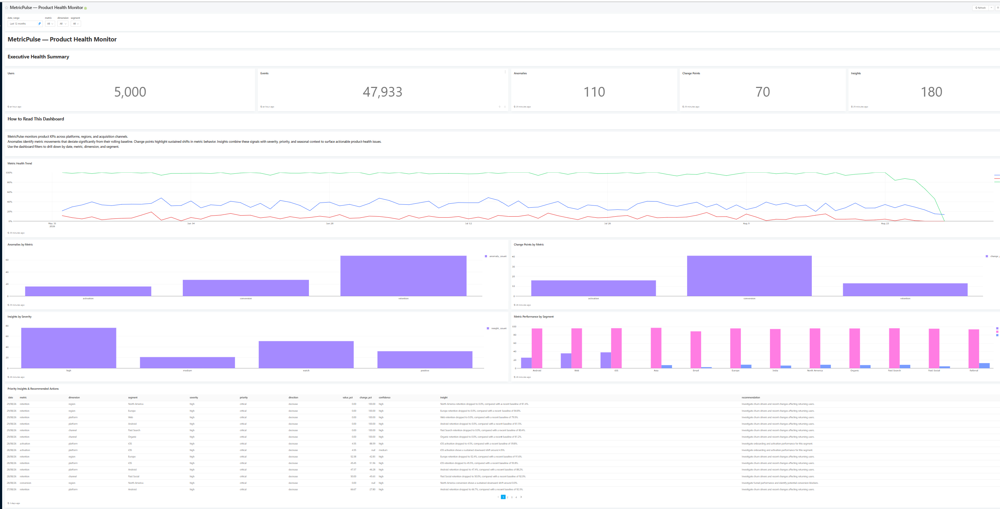

# 📊 MetricPulse — Product Health Monitor

> An automated product analytics system for detecting KPI anomalies, identifying meaningful metric shifts, and turning them into actionable product insights.

MetricPulse is an end-to-end product health monitoring pipeline designed to move beyond static KPI dashboards.

It analyzes product events, calculates key product metrics, detects unusual behavior, identifies structural changes, accounts for seasonality, and generates actionable insights that help product teams understand **what changed, where it changed, and what to investigate next.**

---

## About MetricPulse

MetricPulse was built around a simple question:

> **What if a product dashboard could tell you not only that a metric changed, but also whether the change was unusual, where it happened, and what you should investigate?**

Product metrics can move for many reasons.

A decline in retention might indicate a genuine product problem. A change in conversion could be isolated to a specific acquisition channel. An unusual activation pattern might simply be seasonal behavior.

MetricPulse brings these signals together into a single monitoring workflow.

The system currently monitors three core product metrics:

- **Activation**
- **Conversion**
- **Retention**

across multiple dimensions:

- **Platform**
- **Region**
- **Acquisition Channel**

---

## Core Features

| Feature | What it does |
|---|---|
| 📈 **Product KPI Monitoring** | Tracks activation, conversion, and retention across multiple product dimensions. |
| 🚨 **Anomaly Detection** | Identifies metric movements that significantly deviate from recent rolling baselines. |
| 📍 **Change-Point Detection** | Detects meaningful shifts in metric behavior that may indicate a sustained change. |
| 🌱 **Seasonality Analysis** | Separates trend and seasonal behavior from unexpected residual movement. |
| 🔍 **Segment Analysis** | Drills into platform, region, and acquisition-channel performance. |
| 💡 **Automated Insights** | Converts detected signals into interpretable product-health insights. |
| ⚠️ **Severity Classification** | Categorizes insights based on the significance of the detected movement. |
| 🎯 **Priority Classification** | Helps identify which issues deserve the most immediate attention. |
| 🧠 **Seasonal Context** | Distinguishes unusual movements from behavior that may be explained by seasonality. |
| 📝 **Actionable Recommendations** | Generates recommendations for further investigation based on detected patterns. |
| 📊 **Interactive Dashboard** | Provides an executive-facing Redash dashboard for monitoring product health. |
| 🔎 **Dashboard Filters** | Enables drill-down by date, metric, dimension, and segment. |

---

## How MetricPulse Works

MetricPulse follows an end-to-end analytics pipeline:

**1. Generate Product Data**  
Create users and product events representing realistic product activity.

**2. Build Metric Observations**  
Transform raw events into product-health metrics across different segments.

**3. Detect Anomalies**  
Compare observations against rolling baselines to identify unusual movements.

**4. Detect Change Points**  
Identify sustained shifts in metric behavior.

**5. Analyze Seasonality**  
Separate trend, seasonal patterns, and unexpected residual behavior.

**6. Generate Insights**  
Combine analytical signals into understandable product-health insights.

**7. Prioritize Findings**  
Assign severity, priority, direction, and confidence.

**8. Visualize Product Health**  
Surface the results through an interactive Redash dashboard.

```text
Users + Events
       │
       ▼
Data Generation
       │
       ▼
Metric Observation Builder
       │
       ▼
Metric Observations
       │
       ├───────────────┐
       ▼               ▼
Anomaly Detection   Change-Point Detection
       │               │
       └───────┬───────┘
               ▼
       Seasonality Analysis
               │
               ▼
         Insight Engine
               │
               ▼
          PostgreSQL
               │
               ▼
            Redash
               │
               ▼
     Product Health Dashboard

```
---

## Analytics Pipeline

### 📈 Metric Observations

MetricPulse converts raw product activity into structured metric observations.

The pipeline calculates:

- Activation
- Conversion
- Retention

and evaluates these metrics across:

- Platform
- Region
- Acquisition Channel

This creates a consistent analytical layer that downstream detection and insight-generation components can use.
The current observation pipeline includes:

- 7-day activation
- 14-day purchase conversion
- 7-day post-signup retention

These definitions are applied consistently across the generated product data.


### 🚨 Anomaly Detection

MetricPulse uses rolling statistical baselines to identify observations that deviate significantly from recent behavior.

The anomaly detection process uses:

- Rolling mean
- Rolling standard deviation
- Z-score
- Anomaly direction
- Confidence
- Anomaly flag

The basic statistical intuition is:

```text
Observed Value
      │
      ▼
Recent Rolling Baseline
      │
      ▼
Measure Deviation
      │
      ▼
Calculate Z-Score
      │
      ▼
Detect Unusual Movement
      │
      ▼
Direction + Confidence
```

The underlying z-score is based on the relationship:

```bash
z = (observed value - rolling mean) / rolling standard deviation
```
This allows MetricPulse to identify observations that behave unusually relative to their recent history.

### 📍 Change-Point Detection

Not every important product change appears as a single extreme observation.

Sometimes a metric gradually moves into a new behavioral range and remains there.

MetricPulse therefore includes change-point detection to identify meaningful shifts relative to an established baseline.

The analysis incorporates:

- Baseline behavior
- Shift ratio
- Shift percentage
- Cumulative deviation
- Change direction
- Confidence
- Change-point flag

This provides a complementary signal to anomaly detection.

While anomaly detection focuses on unusual observations, change-point detection focuses on meaningful shifts in behavior.


### 🌱 Seasonality Analysis

Not every unusual metric movement represents a product problem.

Some changes may be explained by recurring patterns or broader trends.

MetricPulse uses seasonal decomposition to separate:

- Observed value
- Trend
- Seasonal component
- Residual
- Residual z-score
- Seasonally adjusted value

This provides additional context when interpreting detected anomalies.

Instead of asking only:

```text
"Did the metric change?"
```

MetricPulse can also ask:

```text
"Was the change unusual after accounting for expected seasonal behavior?"
```
This helps reduce the risk of treating expected seasonal movement as a product issue.


### 💡 Insight Engine

The insight engine transforms analytical signals into higher-level product insights.

Instead of simply reporting:

```text
retention = 45.5%
```

MetricPulse can interpret the movement relative to its baseline and generate a more useful finding.

For example:

Web retention dropped significantly compared with its recent baseline.

The generated insight can include:

- Insight type
- Severity
- Priority
- Direction
- Confidence
- Interpretation
- Change percentage
- Seasonal context
- Recommendation

The overall flow is:

```text
Analytical Signal
       │
       ▼
 Interpretation
       │
       ▼
Severity + Priority
       │
       ▼
 Contextual Analysis
       │
       ▼
 Recommendation
```
This turns raw statistical signals into findings that are easier for a product team to investigate.


## Dashboard

MetricPulse is presented through an interactive Redash Product Health Monitor dashboard.

The dashboard follows an executive-to-diagnostic workflow:

Executive Summary → Metric Health → Detection → Segmentation → Action



### Executive Health Summary

The dashboard provides a high-level overview of the product monitoring system.

| KPI | Current Result |
|---|---|
| 👥 **Users** | 5,000 |
| ⚡ **Events** | 47,933 |
| 🚨 **Anomalies** | 110 |
| 📍 **Change Points** | 70 |
| 💡 **Insights** | 180 |

The Users and Events KPIs provide overall dataset context, while Anomalies, Change Points, and Insights respond to the dashboard's analytical filters.

### Metric Health Trend

Tracks activation, conversion, and retention over time.

This provides an immediate overview of product-health movement and helps identify periods where metrics begin to behave differently from their normal patterns.

### Anomalies by Metric

Shows detected anomaly counts across:

- Activation
- Conversion
- Retention

This makes it easier to identify which product metrics currently contain the highest concentration of unusual observations.

### Change Points by Metric

Shows detected change points across:

- Activation
- Conversion
- Retention

This provides a different perspective from anomaly detection by focusing on meaningful shifts rather than isolated unusual observations.

### Insights by Severity

Groups generated insights according to severity:

- High
- Medium
- Watch
- Positive

This allows users to quickly distinguish critical product-health concerns from lower-priority observations.

### Metric Performance by Segment

Compares product metrics across different segments such as:

- Android
- iOS
- Web
- Regions
- Acquisition Channels

This enables deeper investigation into questions such as:

```text
Which segment is contributing to a metric decline?
```

### Priority Insights & Recommended Actions

The dashboard's final section provides detailed product-health findings.
Each insight can include:

- Date
- Metric
- Dimension
- Segment
- Severity
- Priority
- Direction
- Current value
- Change percentage
- Confidence
- Insight
- Recommendation

This section bridges the gap between analytics and action.

## Dashboard Filters

MetricPulse supports dashboard-level filtering across the analytical views.

| Filter | Purpose |
|---|---|
| 📅 **Date Range** | Focus analysis on a specific time period. |
| 📈 **Metric** | Investigate activation, conversion, or retention. |
| 🧩 **Dimension** | Filter by platform, region, or acquisition channel. |
| 🎯 **Segment** | Drill into a specific product segment. |

The filters work across the dashboard, allowing users to move from a broad product-health overview to a specific segment without manually changing individual queries.


## Database

MetricPulse uses PostgreSQL as the analytical storage layer.

| Table | Purpose |
|---|---|
| **users** | Stores generated user-level information. |
| **events** | Stores product activity and user events. |
| **metric_observations** | Stores calculated product-health metrics. |
| **anomalies** | Stores anomaly detection results. |
| **change_points** | Stores detected metric shifts. |
| **seasonal_analysis** | Stores seasonal decomposition results. |
| **insights** | Stores generated product-health insights and recommendations. |

This structure separates raw product activity from derived analytical results and generated insights.

## Project Structure

```text
MetricPulse_is_here/
│
├── data/
│   ├── raw/
│   │   ├── users.csv
│   │   └── events.csv
│   │
│   └── processed/
│       ├── metric_observations.csv
│       ├── anomalies.csv
│       ├── change_points.csv
│       ├── seasonal_analysis.csv
│       └── insights.csv
│
├── sql/
│   ├── schema.sql
│   └── ...
│
├── src/
│   ├── data_generator.py
│   ├── export_kpis.py
│   ├── build_observations.py
│   ├── anomaly_detector.py
│   ├── change_point_detector.py
│   ├── seasonal_analyzer.py
│   ├── insight_engine.py
│   └── ...
│
├── requirements.txt
├── docker-compose.yml
└── README.md
```

## Tech Stack

### Data & Analytics

`Python` · `Pandas` · `NumPy`

### Statistical Analysis

`Statsmodels`

### Database

`PostgreSQL` · `SQL`

### Business Intelligence

`Redash`

### Infrastructure

`Docker` · `Docker Compose`

### Development

`Git` · `GitHub`


## Running the Project
### 1. Clone the Repository
```bash
git clone <your-repository-url>
cd MetricPulse_is_here
```
### 2. Create a Virtual Environment
```bash
python -m venv venv
```
Activate it on Windows PowerShell:
```bash
.\venv\Scripts\Activate.ps1
```
### 3. Install Dependencies
```bash
pip install -r requirements.txt
```
### 4. Start PostgreSQL
MetricPulse uses PostgreSQL through Docker.
```bash
docker compose up -d
```
### 5. Generate Product Data
```bash
python src/data_generator.py
```
### 6. Build Metric Observations
```bash
python src/build_observations.py
```
### 7. Run Anomaly Detection
```bash
python src/anomaly_detector.py
```
### 8. Run Change-Point Detection
```bash
python src/change_point_detector.py
```
### 9. Run Seasonality Analysis
```bash
python src/seasonal_analyzer.py
```
### 10. Generate Product Insights
```bash
python src/insight_engine.py
```

The resulting analytical datasets can then be loaded into PostgreSQL and visualized through Redash.


## Pipeline Execution Order

The overall analytical workflow is:
```text
Data Generation
      │
      ▼
Users + Events
      │
      ▼
Metric Observation Builder
      │
      ▼
Metric Observations
      │
      ├───────────────┐
      ▼               ▼
Anomaly Detection   Change-Point Detection
      │               │
      └───────┬───────┘
              ▼
      Seasonality Analysis
              │
              ▼
        Insight Engine
              │
              ▼
          PostgreSQL
              │
              ▼
            Redash
```
Each stage produces a structured analytical output that can be used by the next stage of the pipeline.

## Why I Built This

MetricPulse was built to explore how product analytics can move beyond static dashboards.

Instead of simply showing that a KPI changed, the project attempts to answer three deeper questions:
```text
What changed?

Where did it change?

What should we investigate next?
```
The project brings together:

**Data Engineering + SQL + Statistical Analysis + Product Analytics + Business Intelligence**

into a single end-to-end product monitoring workflow.

The goal is to make important product signals easier to detect, understand, and investigate.

## Author

**Aamina Shaik**

`Data Science` · `Data Analytics` · `Product Analytics`